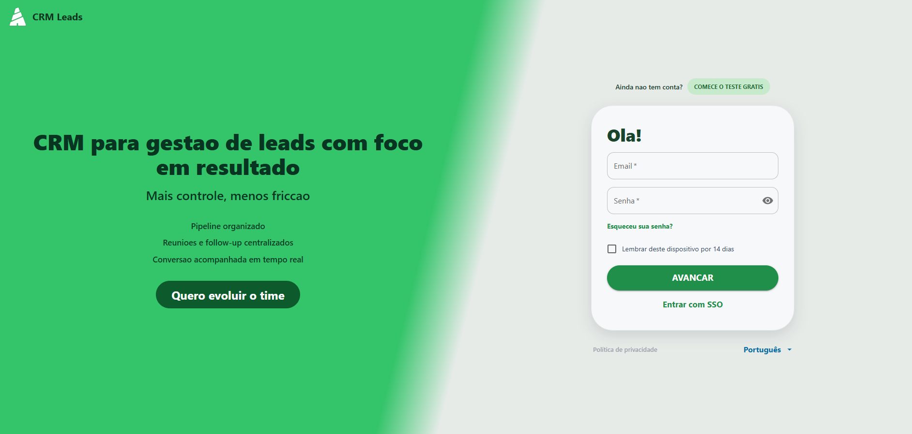
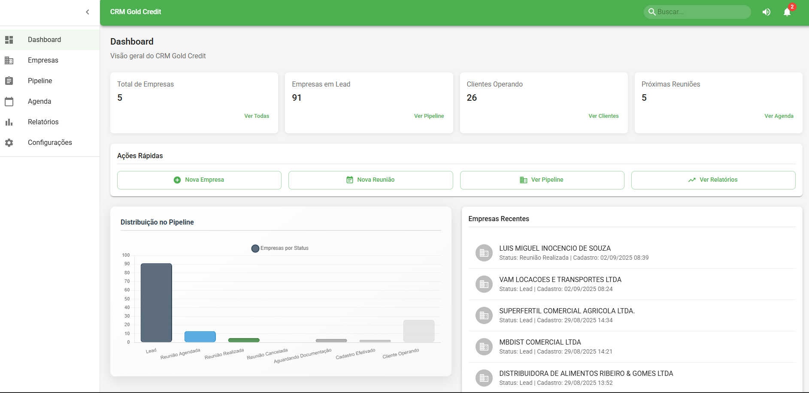
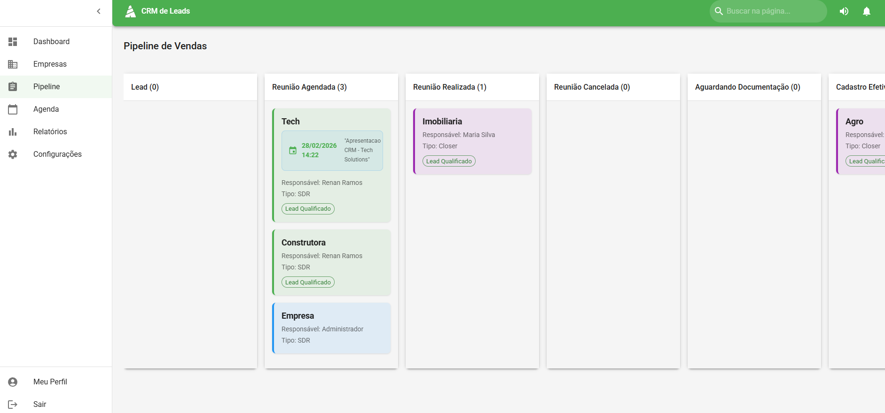
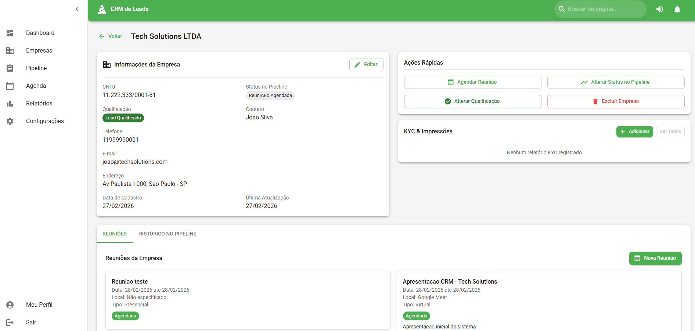

# CRM Leads

<p align="center">
  CRM full stack para gestao de leads, pipeline comercial, agenda de reunioes e relatorios operacionais.
</p>

<p align="center">
  
  
  
  
  
  
</p>

## Visao Geral

O **CRM Leads** e uma aplicacao web para times comerciais que precisam:

- centralizar cadastro de empresas e contatos
- controlar o funil de vendas com pipeline visual (drag and drop)
- gerenciar agenda de reunioes
- acompanhar conversao com dashboards e relatorios
- aplicar regras de acesso por perfil (ADM, SDR, Closer, Supervisor)

## Destaques Para Recrutadores

- Arquitetura em camadas no backend (`routes -> controllers -> services -> models`)
- Frontend modular com React + Context API para autenticacao e notificacoes
- Autenticacao JWT com protecao de rotas e controle por papeis (RBAC)
- Integracao externa para consulta de CNPJ com fallback de provedores
- Exportacao de relatorios em PDF/Excel
- Seed e setup de banco organizados em pasta dedicada (`backend/database`)

## Tecnologias Utilizadas

### Frontend

- React 18
- React Router DOM
- Material UI (MUI)
- Chart.js + react-chartjs-2
- React Big Calendar
- Formik + Yup
- Axios
- React Toastify
- @hello-pangea/dnd (drag and drop no pipeline)

### Backend

- Node.js
- Express
- Mongoose
- JWT (jsonwebtoken)
- bcryptjs
- multer (upload de imagem de perfil)
- express-validator
- helmet, cors, morgan
- PDFKit e ExcelJS

### Banco de Dados

- MongoDB
- Scripts de banco:
- `backend/database/setup-database.js`
- `backend/database/seed.js`

### Integracoes Externas

- BrasilAPI (consulta CNPJ)
- ReceitaWS (fallback de consulta CNPJ)

## Funcionalidades Principais

- Login com sessao JWT
- Dashboard com indicadores e grafico de pipeline
- Gestao de empresas (CRUD completo)
- Consulta automatica de CNPJ para pre-preenchimento de dados
- Pipeline de vendas com mudanca de status por arrastar e soltar
- Agenda de reunioes com visualizacao em calendario
- KYC e historico de movimentacoes por empresa
- Relatorios com filtros e exportacao
- Perfil de usuario com upload de foto

## Arquitetura do Projeto

```text
CRM-FullStack/
|-- backend/
|   |-- config/
|   |-- controllers/
|   |-- middlewares/
|   |-- models/
|   |-- routes/
|   |-- services/
|   |-- database/         # setup e seed do MongoDB
|   |-- tools/            # utilitarios de apoio
|   |-- uploads/
|   `-- server.js
|-- frontend/
|   |-- src/
|   |   |-- components/
|   |   |-- contexts/
|   |   |-- pages/
|   |   |-- services/
|   |   `-- utils/
|   `-- public/
`-- prints/
```

## Telas do Sistema

- Login customizado com identidade visual do produto
- Dashboard operacional com cards e graficos
- Pagina de empresas com busca, filtros e acoes rapidas
- Pipeline comercial em colunas com drag and drop
- Agenda de reunioes (visoes de calendario)
- Relatorios e analise de conversao

### Capturas







## Endpoints Relevantes

- `POST /api/users/login`
- `GET /api/users/me`
- `PUT /api/users/profile`
- `GET /api/companies`
- `POST /api/companies`
- `GET /api/companies/cnpj/:cnpj`
- `GET /api/pipeline`
- `POST /api/pipeline/update-status`
- `GET /api/meetings`
- `POST /api/meetings`
- `GET /api/reports/full`

## Como Executar Localmente

### Pre-requisitos

- Node.js 18+
- npm 9+
- MongoDB local ou remoto (Atlas)

### 1. Clone o repositorio

```bash
git clone https://github.com/Draxsd3/crm-fullstack
cd CRM-FullStack
```

### 2. Configure o backend

```bash
cd backend
npm install
# Windows (PowerShell)
copy .env.example .env
# Linux/macOS
# cp .env.example .env
```

Ajuste as variaveis em `backend/.env`, principalmente:

- `MONGODB_URI`
- `JWT_SECRET`
- `PORT`
- `ALLOWED_ORIGINS`

### 3. Prepare o banco

```bash
npm run db:setup:seed
```

Ou, se quiser reset completo:

```bash
npm run db:reset
```

### 4. Configure o frontend

```bash
cd ../frontend
npm install
npm start
```

### 5. Inicie o backend (em outro terminal)

```bash
cd backend
npm run dev
```

## Credenciais de Demonstracao

Essas contas sao criadas pelo seed:

- `admin@crmleads.com` / `Admin@2024` (ADM)
- `renan@crmleads.com` / `Renan@2004` (SDR)
- `maria@crmleads.com` / `Maria@2024` (Closer)
- `carlos@crmleads.com` / `Carlos@2024` (Supervisor)

## Qualidade e Seguranca

- validacoes de entrada no backend (express-validator)
- senhas com hash bcrypt
- JWT para autenticacao stateless
- middlewares de seguranca HTTP com helmet
- CORS configuravel por ambiente

## Roadmap (Evolucao)

- testes automatizados (backend e frontend)
- CI/CD com pipeline de build e deploy
- auditoria de atividades por usuario
- dashboard com KPIs avancados por etapa

## Licenca

Projeto sob licenca MIT. Veja [`LICENSE`](./LICENSE).
