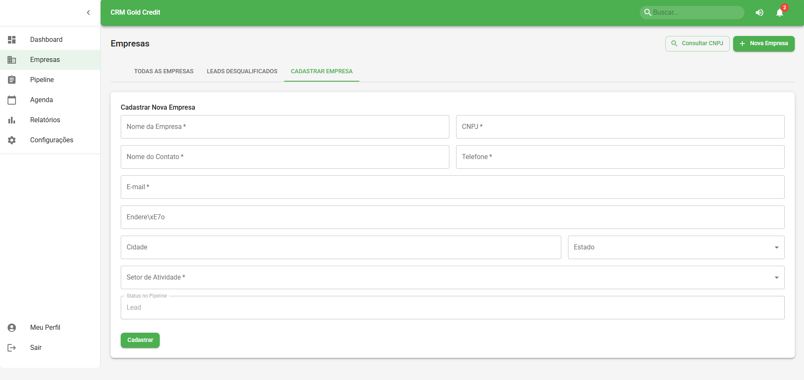

# CRM GoldCredit

Sistema de CRM para gestão de empresas, pipeline de vendas e automação de processos comerciais.

---

## Funcionalidades

- **Cadastro de Empresas:** Gerencie informações completas de clientes e empresas.
- **Pipeline Visual:** Acompanhe o progresso das oportunidades em diferentes etapas do funil de vendas.
- **Consulta de CNPJ:** Integração automática com a ReceitaWS para validação de dados cadastrais.
- **Histórico de Atividades:** Registro de todas as movimentações e interações.
- **Notificações e Relatórios:** Alertas e relatórios para tomada de decisão.
- **Controle de Usuários:** Permissões e papéis para diferentes tipos de usuários.

---

## Prints do Sistema

> _Adicione aqui prints das principais telas do sistema para ilustrar as funcionalidades!_

- **Dashboard**  
  

- **Pipeline de Vendas**  
  

- **Cadastro de Empresa**  
  

---

## Tecnologias Utilizadas

- **Frontend:** React + Material-UI  
- **Backend:** Node.js + Express + Sequelize  
- **Banco de Dados:** MySQL  
- **APIs Externas:** ReceitaWS

---

## Como rodar o projeto

1. **Clone o repositório:**
   ```bash
   git clone https://github.com/Draxsd3/crm_goldcredit
   ```

2. **Instale as dependências do backend e frontend:**
   ```bash
   cd crm_goldcredit/backend
   npm install
   cd ../frontend
   npm install
   ```

3. **Configure os arquivos `.env` conforme o exemplo.**

4. **Inicie o backend e o frontend:**
   ```bash
   # Em dois terminais separados
   cd backend && npm start
   cd frontend && npm start
   ```

---

## Licença

Projeto privado e de uso exclusivo da equipe
